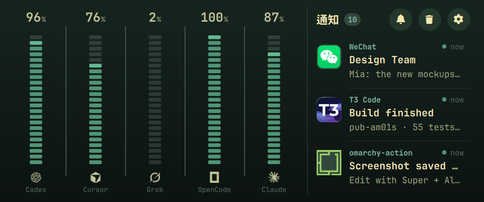
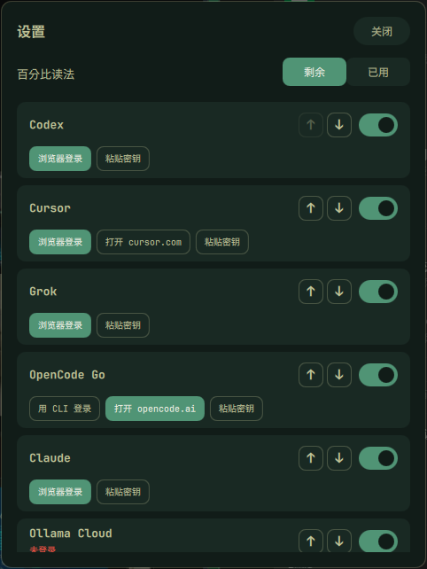

# pub-am01s

PUB 在 Omarchy（Hyprland）上的 AM01S 副屏。副屏整块显示 Plan Quota 和通知，设置在主屏弹出。





## 前提

- Omarchy（Hyprland），装有 `git`、`python3`、`node`。
- 安装 [AM01S-SubScreen-Driver](https://github.com/NOirBRight/AM01S-SubScreen-Driver)，并让这块屏作为一块 960×400 的 DRM 显示器出现（`ChangHong Electric Co.Ltd 0x0030`）。

## 安装

```bash
curl -fsSL https://raw.githubusercontent.com/NOirBRight/pub-am01s/main/install.sh | bash
```

它把最新 Release 克隆到 `~/.local/share/pub-am01s`，运行其中的 `scripts/install.py`，再重载 Hyprland 和 Omarchy shell。装完从 Omarchy 菜单「PUB 设置」登录 Provider。

`scripts/install.py` 按仓库里的 `engine.tag` 下载 PUB 的 Release 附件，钉在 `plugin/bin/pub-engine.mjs`，再把插件、Hyprland 片段和菜单项装进当前用户的配置目录。再跑一次不会重复添加。插件只跑这份钉住的文件。

## 升级

再运行一次上面的命令，会切到最新 Release。要装指定版本，把管道后的 `bash` 换成 `PUB_AM01S_REF=v0.1.0 bash`。

## 从源码安装

```bash
git clone https://github.com/NOirBRight/pub-am01s.git
cd pub-am01s
python3 scripts/install.py
```

改 `engine.tag` 后重新运行 `python3 scripts/install.py`，会换成对应的 PUB Release 附件。
